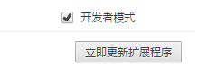
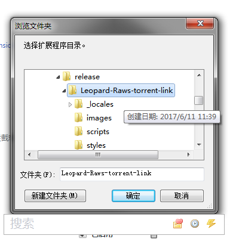
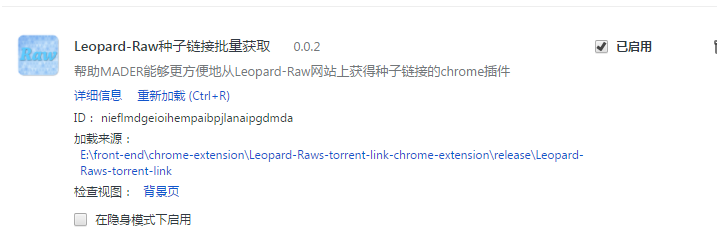
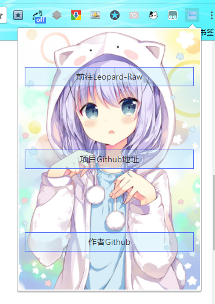
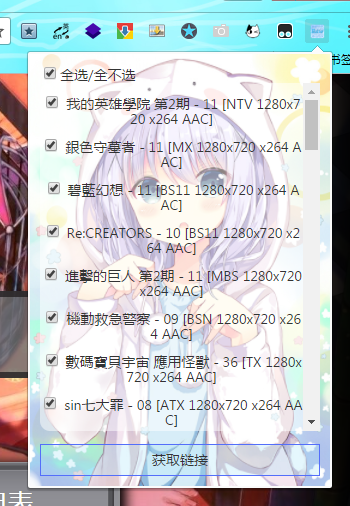
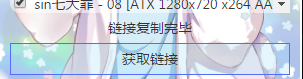
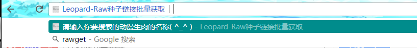

## 安装步骤

1. 打开chrome浏览器，在地址栏中输入 `chrome://extensions/` 进入扩展程序页面

2. 勾选开发者模式

3. 将下载下来的crx文件更改后缀名为rar并解压

4. 点击“加载已解压的扩展程序”，选择解压后的文件夹

4. 安装完成

## 使用方法

1. 在非Leopard-Raw网站的页面下，点击扩展图标会出现扩展窗口：

	- 点击“前往Leopard-Raw”按钮可以打开Leopard-Raw网页
	- “项目Github地址”和“作者Github”按钮可以进入到扩展项目和作者的Github页面，欢迎给Star ( ^_^ )

2. 在Leopard-Raw网站的页面下，点击扩展图片会出现扩展窗口：

勾选需要的生肉后点击下方的“获取链接”按钮，会显示复制完成信息：

此时所有链接就已经被复制到你的剪贴板中了，之后就可以把链接复制到下载器中进行下载了

**PS:**若出现一直等待无法获取链接的情况（3秒以上），请尝试刷新页面使其重新加载扩展代码。

3. 在浏览器地址栏中输入`rawget`并按下Tab键，可以使用快速搜索功能：

输入要搜索的动画名称并回车可以直接打开搜索结果页面